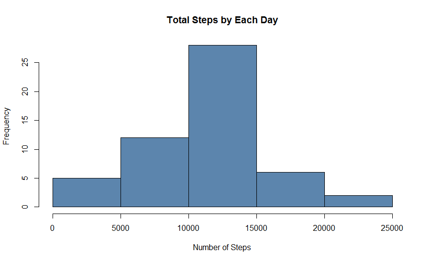
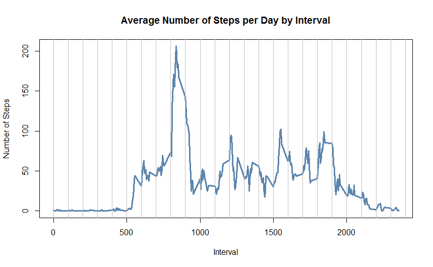
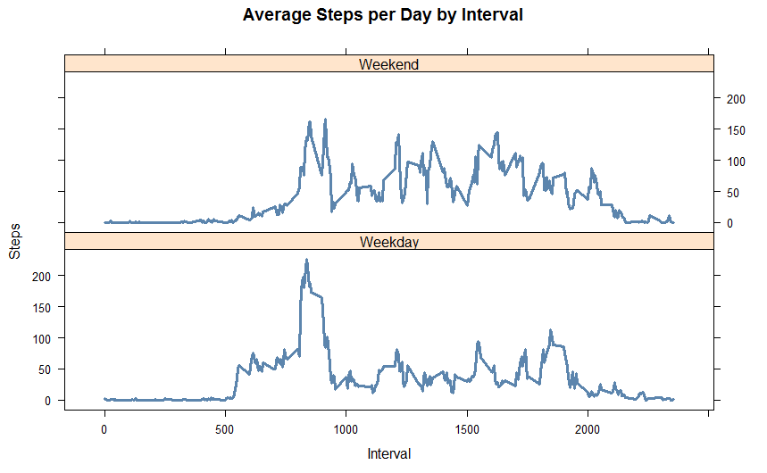

## Loading and preprocessing the data

### Instructions
This assignment makes use of data from a personal activity monitoring device. This device collects data at 5 minute intervals through out the day. The data consists of two months of data from an anonymous individual collected during the months of October and November, 2012 and include the number of steps taken in 5 minute intervals each day.

This assignment will be described in multiple parts. You will need to write a report that answers the questions detailed below. Ultimately, you will need to complete the entire assignment in a **single R markdown** document that can be processed by **knitr** and be transformed into an HTML file.

Throughout your report make sure you always include the code that you used to generate the output you present. When writing code chunks in the R markdown document, always use echo = TRUE so that someone else will be able to read the code.

### Data
The data for this assignment was downloaded from the course web
site:

* Dataset: [Activity monitoring data](https://d396qusza40orc.cloudfront.net/repdata%2Fdata%2Factivity.zip) [52K]

The variables included in this dataset are:

* **steps**: Number of steps taking in a 5-minute interval (missing
    values are coded as `NA`)

* **date**: The date on which the measurement was taken in YYYY-MM-DD
    format

* **interval**: Identifier for the 5-minute interval in which
    measurement was taken

The dataset is stored in a comma-separated-value (CSV) file and there are a total of 17,568 observations in this dataset.

### Loading and preprocessing the data

The following code is for Download, Unzip and Load data into data frame `ActMonData`, under the folder  __**RepRes**__. 

```r
if(!file.exists("./RepRes")){dir.create("./RepRes")}
fileUrl <- "http://d396qusza40orc.cloudfront.net/repdata%2Fdata%2Factivity.zip"
download.file(fileUrl,destfile="./RepRes/repdata%2Fdata%2Factivity.zip",method="curl")

unzip(zipfile="./RepRes/repdata%2Fdata%2Factivity.zip",exdir="./RepRes")

ActMonData <- read.csv("./RepRes/activity.csv")
```


## What is mean total number of steps taken per day?

For this part of the assignment, the missing values in the dataset was ignored.

* Calculate the total number of steps taken per day `Stepsbyday`. 

```r
Stepsbyday <- aggregate(steps ~ date, ActMonData, sum)
```
* Make a histogram of the total number of steps taken each day

```r
hist(Stepsbyday$steps, main = paste("Total Steps by Each Day"), col=rgb(0.2,0.4,0.6,0.8), xlab="Number of Steps")
```

 


* Calculate and report the mean and median of the total number of steps taken per day

```r
Smean <- mean(Stepsbyday$steps)
Smedian <- median(Stepsbyday$steps)
```

* The mean and median of the total number of steps taken per day are: The `mean` is 1.0766 &times; 10<sup>4</sup> and the `median` is 10765.


## What is the average daily activity pattern?

* Make a time series plot (i.e. type = "l") of the 5-minute interval (x-axis) and the average number of steps taken, averaged across all days (y-axis)

```r
Stepsbydayinterval <- aggregate(steps ~ interval, ActMonData, mean)
```

```r
plot(Stepsbydayinterval$interval,Stepsbydayinterval$steps,lwd=3, type="l", xlab="Interval", ylab="Number of Steps",col=rgb(0.2,0.4,0.6,0.8),main="Average Number of Steps per Day by Interval")
abline(v=seq(0,3000,100) , col="grey" , lwd=0.6)
```

 


* Which 5-minute interval, on average across all the days in the dataset, contains the maximum number of steps?

```r
maxinterval <- Stepsbydayinterval[which.max(Stepsbydayinterval$steps),1]
```

The 5-minute interval, on average across all the days in the data set, containing the maximum number of steps is `835`.


## Imputing missing values

Note that there are a number of days/intervals where there are missing values (coded as NA). The presence of missing days may introduce bias into some calculations or summaries of the data.

* Calculate and report the total number of missing values in the dataset

```r
MissingDate <- sum(!complete.cases(ActMonData))
```
The total number of missing values are 2304

* Devise a strategy for filling in all of the missing values in the dataset. The strategy does not need to be sophisticated and Create a new dataset that is equal to the original dataset but with the missing data filled in. 

```r
imputedData <- transform(ActMonData, steps = ifelse(is.na(ActMonData$steps), Stepsbydayinterval$steps[match(ActMonData$interval, Stepsbydayinterval$interval)], ActMonData$steps))
```
Missing values were imputed by inserting the average for each interval. The interval 10 was missing on 10-02-2012, the average for that interval for all days (0.1320755), replaced the NA.

```r
imputedData[as.character(imputedData$date) == "2012-10-01", 1] <- 0
```

* Make a histogram of the total number of steps taken each day and Calculate and report the mean and median total number of steps taken per day. Do these values differ from the estimates from the first part of the assignment? What is the impact of imputing missing data on the estimates of the total daily number of steps?

Histogram of the total number of steps taken each day after missing values are imputed:

```r
stepsbydaymissing <- aggregate(steps ~ date, imputedData, sum)
hist(stepsbydaymissing$steps, main = paste("Total Steps Each Day"), col=rgb(0.2,0.4,0.6,0.8), xlab="Number of Steps")

hist(Stepsbyday$steps, main = paste("Total Steps Each Day"), col=rgb(0.8,0.0,0.0,0.8), xlab="Number of Steps", add=T)
legend("topright", c("Imputed", "Non-imputed"), col=c(rgb(0.2,0.4,0.6,0.8), rgb(0.8,0.0,0.0,0.8)), lwd=10)
```

 


* Calculate new mean and median for imputed data. 

```r
Smeaninterval <- mean(stepsbydaymissing$steps)
Smedianinterval <- median(stepsbydaymissing$steps)
```

* Calculate difference between imputed and non-imputed data.

```r
meandiff <- Smeaninterval - Smean
meddiff <- Smedianinterval - Smedian
```

* Calculate total difference.

```r
totaldiff <- sum(stepsbydaymissing$steps) - sum(Stepsbyday$steps)
```

Conclusions:

* The imputed data mean is 1.059 &times; 10<sup>4</sup>
* The imputed data median is 1.0766 &times; 10<sup>4</sup>
* The difference between the non-imputed mean and imputed mean is -176.4949
* The difference between the non-imputed mean and imputed mean is 1.1887
* The difference between total number of steps between imputed and non-imputed data is 7.5363 &times; 10<sup>4</sup>. 


## Are there differences in activity patterns between weekdays and weekends?

For this part the weekdays() function may be of some help here. Use the dataset with the filled-in missing values for this part.

* Create a new factor variable in the dataset with two levels – “weekday” and “weekend” indicating whether a given date is a weekday or weekend day.

```r
weekdays <- c("Monday", "Tuesday", "Wednesday", "Thursday", "Friday")

imputedData$dow = as.factor(ifelse(is.element(weekdays(as.Date(imputedData$date)),weekdays), "Weekday", "Weekend"))

Stepsbyinterval2 <- aggregate(steps ~ interval + dow, imputedData, mean)
```

* Panel plot comparing the average number of steps taken per 5-minute interval across weekdays and weekends

```r
library(lattice)

xyplot(Stepsbyinterval2$steps ~ Stepsbyinterval2$interval|Stepsbyinterval2$dow, main="Average Steps per Day by Interval",
       col=rgb(0.2,0.4,0.6,0.8),lwd=3, type="l", xlab="Interval", ylab="Steps",layout=c(1,2))

```

 
